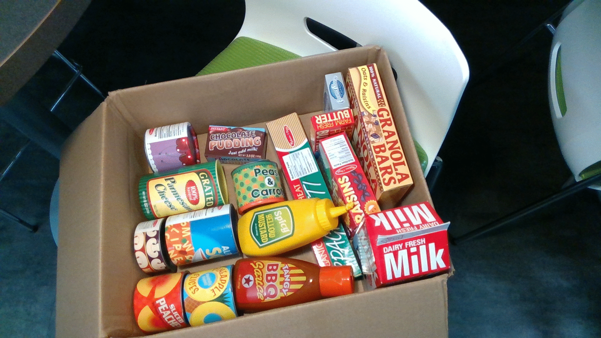
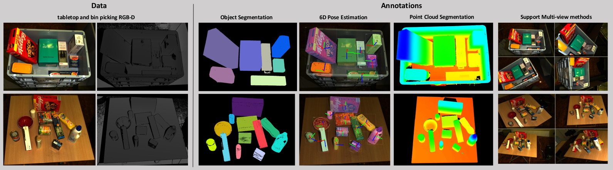

# DoUnseen: Zero shot object classification for robotic grasping

This library contains a pipeline to detect object without training.


The 3 main features of the library:

1- Unseen object segmentation

2- Zero-shot classification

3- Suction point calculation

They can be use separately or cascaded.

## installing dependencies
First, install detectron2 library from [here](https://detectron2.readthedocs.io/en/latest/tutorials/install.html).

Second, install other dependencies with pip:
```
pip install open3d opencv-python argparse torch torchvision
```

Third, install other required ros packages
```
sudo apt install ros-"$ROS_DISTRO"-ros-numpy
```
## Python example
To test the model directly without ROS
```
git clone https://github.com/AnasIbrahim/image_agnostic_segmentation.git
mkdir -p image_agnostic_segmentation/models
cd image_agnostic_segmentation/models
wget https://tu-dortmund.sciebo.de/s/ISdLcDMduHeW1ay/download  -O unseen_object_segmentation.pth
wget https://tu-dortmund.sciebo.de/s/yhmj8xblrKiuBLr/download -O classification_siamese_net.pth
cd ../scripts

# to run the example that run. The examples runs:
# 1- unseen object segmentation
# 2- classify all objects
# 3- find a specific object
# 4- calculate suction grasp for all objects
python segment_image.py --compute-suction-pts --detect-all-objects --detect-one-object --use-buffered-gallery

# To run the unseen object segmentation only with RGB images
python segment_image.py --rgb-image-path RGB_IMAGE_PATH

# To detect a specific object from RGB images from a gallery 
python segment_image.py --rgb-image-path RGB_IMAGE_PATH --detect-one-object --object-name OBJECT_NAME --gallery_path GALLERY_PATH

# To detect all objects from RGB images with a pre-taken image of the object
python segment_image.py --rgb-image-path RGB_IMAGE_PATH --detect-all-objects --gallery_path GALLERY_PATH

# To segment an image and compute grasps
python segment_image.py --rgb-image-path RGB_IMAGE_PATH --depth-image-path DEPTH_IMAGE_PATH --depth-scale DEPTH_SCALE -c-matrix FX 0.0 CX 0.0 FY CY 0.0 0.0 1.0 --compute-suction-pts
```

The examples shows the following scene:


## ROS
To install the ROS driver:
```
mkdir -p catkin_ws/src
cd catkin_ws/
catkin init
cd src/
git clone https://github.com/AnasIbrahim/image_agnostic_segmentation.git
mkdir image_agnostic_segmentation/models; cd image_agnostic_segmentation/models
wget https://tu-dortmund.sciebo.de/s/ISdLcDMduHeW1ay/download  -O unseen_object_segmentation.pth
wget https://tu-dortmund.sciebo.de/s/yhmj8xblrKiuBLr/download -O classification_siamese_net.pth
cd ../../..
catkin build
echo "source $(pwd)/devel/setup.bash" >> ~/.bashrc
source ~/.bashrc
```
To run ROS example (unseen object segmentation only):
```
roslaunch image_agnostic_segmentation test_example.launch
```
Then wait till the segmentation image then grasping image appears (~10 second)


## DoPose Dataset
Th unseen object segmentation model was trained with our Dopose data.
The dataset can be downloaded [here](https://zenodo.org/record/6103779).
The dataset is saved in the [BOP format](https://github.com/thodan/bop_toolkit/blob/master/docs/bop_datasets_format.md).
It includes multi-view of storage bin (KLT Euro container) and tabletop scenes.
The annotations include RGB and depth images, 6D pose of each object, segmentation masks, COCO json annotations. Also the dataset includes camera transformations between different views of the same scene (this is extra non-standard to BOP format).

Samples from the dataset:


# Paper and Citation
For more details about the DoPose dataset or the unseen object segmentation model please refer to [Arxiv](https://arxiv.org/abs/2204.13613) and use this citation:
```
@INPROCEEDINGS{10069586,
  author={Gouda, Anas and Ghanem, Abraham and Reining, Christopher},
  booktitle={2022 21st IEEE International Conference on Machine Learning and Applications (ICMLA)}, 
  title={DoPose-6D dataset for object segmentation and 6D pose estimation}, 
  year={2022},
  volume={},
  number={},
  pages={477-483},
  doi={10.1109/ICMLA55696.2022.00077}}

```

For more details about the zero shot classification please refer to [arvix](https://arxiv.org/abs/2304.02833):
```
@misc{gouda2023dounseen,
      title={DoUnseen: Zero-Shot Object Detection for Robotic Grasping}, 
      author={Anas Gouda and Moritz Roidl},
      year={2023},
      eprint={2304.02833},
      archivePrefix={arXiv},
      primaryClass={cs.CV}
}
```
