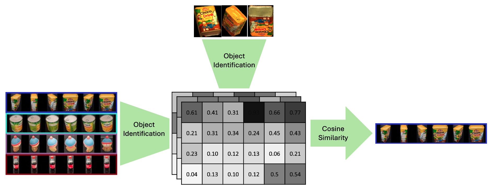
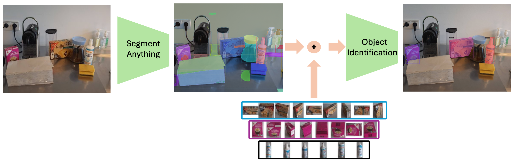
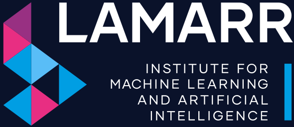

<h1 align="center">


Segment & Classify-Anthing for Robotic Grasping
</h1><br>

The DoUnseen package segments and classifies novel objects in just few lines of code. Without any training or fine-tuning.

Try it on
<a href="https://huggingface.co/spaces/anas-gouda/dounseen">
HuggingFace
  
</a>


## Usage modes

1. Standalone mode
<h1 align="center">

</h1><br>

2. Full Segmentation Pipeline (extension to Segment Anything and zero-shot segmentation models)
<h1 align="center">

</h1><br>

## Installation

To use the full segmentation pipeline, you need to install any zero-shot segmentation model.
Any zero-shot segmentation model can be used with DoUnseen.

We use Segment Anything 2 as an example.
Note that SAM2 uses Python>= 3.10. This is not required for DoUnseen.
Please install SAM2 it as follows:

```commandline
git clone https://github.com/facebookresearch/sam2.git && cd sam2 && pip install -e .
```

Install DoUnseen:
```commandline
pip install git+https://github.com/AnasIbrahim/image_agnostic_segmentation.git
```

Download the pretrained models from HuggingFace using git LFS:
```commandline
cd image_agnostic_segmentation
git lfs install  # if not installed
git clone https://huggingface.co/anas-gouda/dounseen models/
```

## How to use 
First, Import dounseen and set up the classifier
```python
from dounseen.core import UnseenClassifier
import dounseen.utils as dounseen_utils

unseen_classifier = dounseen.core.UnseenClassifier(
  gallery_images=None,  # Can be setup later using update_gallery()
  gallery_buffered_path=None,
  augment_gallery=False,
  batch_size=80,
)
```

1- Standalone mode

```python
# Load query images of a single object as PIL images
from PIL import Image
query_images = [Image.open("object_1.jpg"), Image.open("object_2.jpg"), Image.open("object_3.jpg")]
# Update the gallery with the gallery images path
gallery_path = "PATH/TO/GALLERY"  # containing folders of objects object_xxx, object_yyy, object_zzz
unseen_classifier.update_gallery(gallery_path=gallery_path)
# To find which of the query images is the same as obj_xxx from the gallery
object_name, score = unseen_classifier.find_object(query_images, obj_name="obj_xxx", method="max")
# To find a match for all query objects from the gallery
class_predictions, class_scores = unseen_classifier.classify_all_objects(query_images, threshold=0.3, multi_instance=False)
```

2- Full segmentation pipeline (extension to Segment-Anything)

load SAM 2 and generate the masks.
```python
torch.autocast("cuda", dtype=torch.bfloat16).__enter__()
# turn on tfloat32 for Ampere GPUs (https://pytorch.org/docs/stable/notes/cuda.html#tensorfloat-32-tf32-on-ampere-devices)
if torch.cuda.get_device_properties(0).major >= 8:
  torch.backends.cuda.matmul.allow_tf32 = True
  torch.backends.cudnn.allow_tf32 = True

# load SAM 2 from HuggingFace
sam2_mask_generator = SAM2AutomaticMaskGenerator.from_pretrained(
  'facebook/sam2-hiera-tiny',
  points_per_side=20,
  points_per_batch=20,
  pred_iou_thresh=0.7,
  stability_score_thresh=0.92,
  stability_score_offset=0.7,
  crop_n_layers=0,
  box_nms_thresh=0.7,
  multimask_output=False,
)
```
load and segment the image.
```python
rgb_img = Image.open('/PATH/TO/IMAGE.jpg')
rgb_img = np.array(rgb_img.convert("RGB"))
sam2_output = sam2_mask_generator.generate(rgb_img)
```
prepare SAM 2 output for DoUnseen.
```python
sam2_masks, sam2_bboxes = dounseen.utils.reformat_sam2_output(sam2_output)
```

If you want to remove the background segmentation masks, you can use the BackgroundFilter class.
Most of the time, using this background filter is not necessary.
```python
background_filter = dounseen.core.BackgroundFilter()
sam2_masks, sam2_bboxes = background_filter.filter_background_annotations(rgb_img, sam2_masks, sam2_bboxes)
```

Extract the query images using the masks.
```python
segments = dounseen.utils.get_image_segments_from_binary_masks(rgb_img, sam2_masks, sam2_bboxes)
```

Update the gallery with the gallery images path
```python
gallery_path = "PATH/TO/GALLERY"  # containing folders of objects object_xxx, object_yyy, object_zzz
unseen_classifier.update_gallery(gallery_path=gallery_path)
```

To search the image for a specific object (obj_xxx) from the gallery.
```python
matched_query, score = unseen_classifier.find_object(segments, obj_name="obj_xxx", method="max")
```
To find all gallery objects
```python
class_predictions, class_scores = unseen_classifier.classify_all_objects(segments, threshold=0.3, multi_instance=False)
filtered_class_predictions, filtered_masks, filtered_bboxes = dounseen.utils.remove_unmatched_query_segments(class_predictions, sam2_masks, sam2_bboxes)
```


### For a full example please refer to the [segment_image.py](segment_image.py).


## DoPose Dataset
The unseen object segmentation model used for the background filtering was trained using NVIDIA Falling-Things Dataset with our Dopose data.
The DoPose dataset can be downloaded [here](https://zenodo.org/record/6103779).
The dataset is saved in the [BOP format](https://github.com/thodan/bop_toolkit/blob/master/docs/bop_datasets_format.md).
It includes multi-view of storage bin (KLT Euro container) and tabletop scenes.
The annotations include RGB and depth images, 6D pose of each object, segmentation masks, COCO json annotations. Also the dataset includes camera transformations between different views of the same scene.

Samples from the dataset:


## Papers and Citation

The latest version of DoUnseen is highly based on the our paper
**Learning Embeddings with Centroid Triplet Loss for Object Identification in Robotic Grasping**
[[Arxiv](https://arxiv.org/abs/2404.06277)].
The model used in DoUnseen is slightly under-trained compared to the model used in the paper.
```
@misc{gouda2024learningembeddingscentroidtriplet,
      title={Learning Embeddings with Centroid Triplet Loss for Object Identification in Robotic Grasping}, 
      author={Anas Gouda and Max Schwarz and Christopher Reining and Sven Behnke and Alice Kirchheim},
      year={2024},
      eprint={2404.06277},
      archivePrefix={arXiv},
      primaryClass={cs.CV},
      url={https://arxiv.org/abs/2404.06277}, 
}
```

A previous version of this repo was based on our original DoUnseen paper
([Arvix](https://arxiv.org/abs/2304.02833)).
The results presented in that paper were barely an improvement due to lack of datasets at that point of time.
```
@misc{gouda2023dounseen,
      title={DoUnseen: Tuning-Free Class-Adaptive Object Detection of Unseen Objects for Robotic Grasping}, 
      author={Anas Gouda and Moritz Roidl},
      year={2023},
      eprint={2304.02833},
      archivePrefix={arXiv},
      primaryClass={cs.CV}
}
```

Before zero-shot segmentation models like Segment-Anything came out.
This repository offered a similar segmentation method that segmented only household objects.
That was presented and trained using our DoPose dataset.
([Arxiv](https://arxiv.org/abs/2204.13613)).
```
@INPROCEEDINGS{10069586,
  author={Gouda, Anas and Ghanem, Abraham and Reining, Christopher},
  booktitle={2022 21st IEEE International Conference on Machine Learning and Applications (ICMLA)}, 
  title={DoPose-6D dataset for object segmentation and 6D pose estimation}, 
  year={2022},
  volume={},
  number={},
  pages={477-483},
  doi={10.1109/ICMLA55696.2022.00077}}
```


## Latest updates

October 2024: the repo was strongly refactored to be more modular and easier to use
- DoUnseen can be called using few lines of code
- using SAMv2 for segmentation
- Easy installation using pip
- ROS support is removed
- Grasp calculation is removed

Jan 18 2024:
- New classification models were added using ViT and ResNet50 (paper to be added soon)
- classification by calculating centroids of objects was added


### This research is supported by the LAMARR institute
