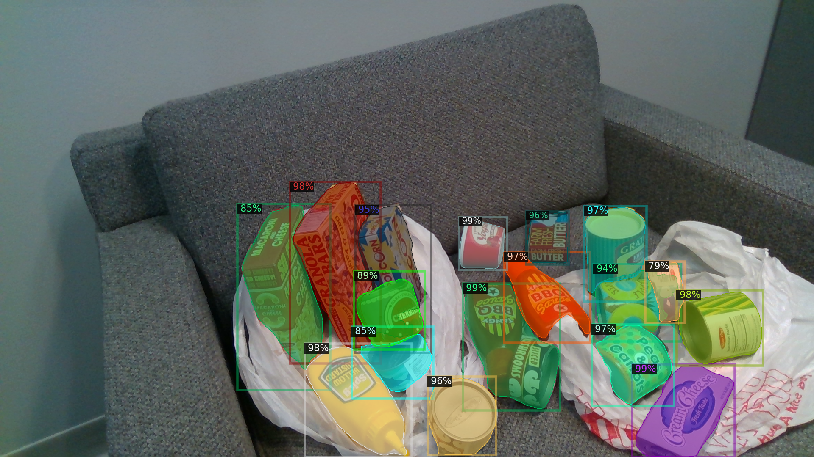
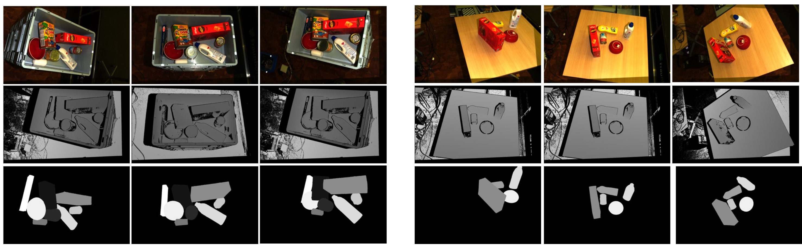

# Unseen object segmentation (Python code and ROS driver)
This repository contains a pipeline that can segment and compute suction grasps for unseen objects
using our category-agnostic CNN.


## Example
This is the result of running our CNN on [NVIDIA hope dataset](https://github.com/swtyree/hope-dataset).
The dataset wasn't used during training neither any of its objects.


## installing dependencies
First, install detectron2 library from [here](https://detectron2.readthedocs.io/en/latest/tutorials/install.html).

Second, install other dependencies with pip:
```
pip install open3d opencv-python argparse
```

Third, install other required ros packages
```
sudo apt install ros-"$ROS_DISTRO"-ros-numpy
```
## Python example
To test the model directly without ROS
```
git clone https://github.com/AnasIbrahim/image_agnostic_segmentation.git
mkdir -p image_agnostic_segmentation/models
cd image_agnostic_segmentation/models
wget https://tu-dortmund.sciebo.de/s/ISdLcDMduHeW1ay/download  -O FAT_trained_Ml2R_bin_fine_tuned.pth
cd ../scripts

# to run the example
python segment_image.py

# To test segmentation only with RGB images
python segment_image.py --compute-no-suction-pts --rgb-image-path RGB_IMAGE_PATH

# To segment an image and compute grasps
python segment_image.py --compute-suction-pts --rgb-image-path RGB_IMAGE_PATH --depth-image-path DEPTH_IMAGE_PATH --depth-scale DEPTH_SCALE -c-matrix FX 0.0 CX 0.0 FY CY 0.0 0.0 1.0
```

The examples shows the following scene:


## ROS
To install the ROS driver:
```
mkdir -p catkin_ws/src
cd catkin_ws/
catkin init
cd src/
git clone https://github.com/AnasIbrahim/image_agnostic_segmentation.git
mkdir image_agnostic_segmentation/models; cd image_agnostic_segmentation/models
wget https://tu-dortmund.sciebo.de/s/ISdLcDMduHeW1ay/download  -O FAT_trained_Ml2R_bin_fine_tuned.pth
cd ../../..
catkin build
echo "source $(pwd)/devel/setup.bash" >> ~/.bashrc
source ~/.bashrc
```
To run ROS example:
```
roslaunch image_agnostic_segmentation test_example.launch
```
Then wait till the segmentation image then grasping image appears (~10 second)


## DoPose Dataset
This CNN model is trained with our Dopose data.
The dataset can be downloaded [here](https://zenodo.org/record/6103779).
The dataset is saved in the [BOP format](https://github.com/thodan/bop_toolkit/blob/master/docs/bop_datasets_format.md).
It includes multi-view of storage bin (KLT Euro container) and tabletop scenes.
The annotations include RGB and depth images, 6D pose of each object, segmentation masks, COCO json annotations. Also the dataset includes camera transformations between different views of the same scene (this is extra non-standard to BOP format).

Samples from the dataset:


# Paper and Citation
To understand how the CNN model in this repository was trained or how the Dopose dataset was created please refer to [our preprint on Arxiv](https://arxiv.org/abs/2204.13613)
```
@misc{gouda2022categoryagnostic,
      title={Category-agnostic Segmentation for Robotic Grasping}, 
      author={Anas Gouda and Abraham Ghanem and Christopher Reining},
      year={2022},
      eprint={2204.13613},
      archivePrefix={arXiv},
      primaryClass={cs.RO}
}
```
