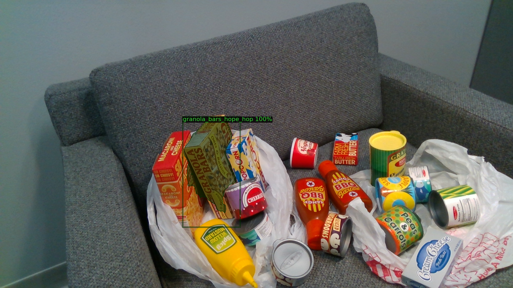

# Image class-agnostic segmentation (Python code and ROS driver)
This repository contains a pipeline that can segment any non-seen objects
using our class-agnostic CNN. The code also can classify objects in the image
if only few images of the objects are available

## inference results
This is the result of using our CNN on [NVIDIA hope dataset](https://github.com/swtyree/hope-dataset).
The dataset wasn't used during training neither any of its objects.


Also this is an example of mask matching with the saved object images in [demo/objects]



## Python non-ROS driver
To test the model directly without ROS
```
git clone https://github.com/FLW-TUDO/image_agnostic_segmentation.git
mkdir -p image_agnostic_segmentation/models
cd image_agnostic_segmentation/models
curl -J -O "https://tu-dortmund.sciebo.de/s/qfNQ2vLdCXW8RBS/FAT_trained_Ml2R_bin_fine_tuned.pth"
cd ../scripts/image_agnostics_segmentation

# to run the example
python3 scripts/image_agnostic_segmentation/segment_image.py

# To test your own images
python3 scripts/image_agnostic_segmentation/segment_image.py --image-path IMAGE_PATH
```